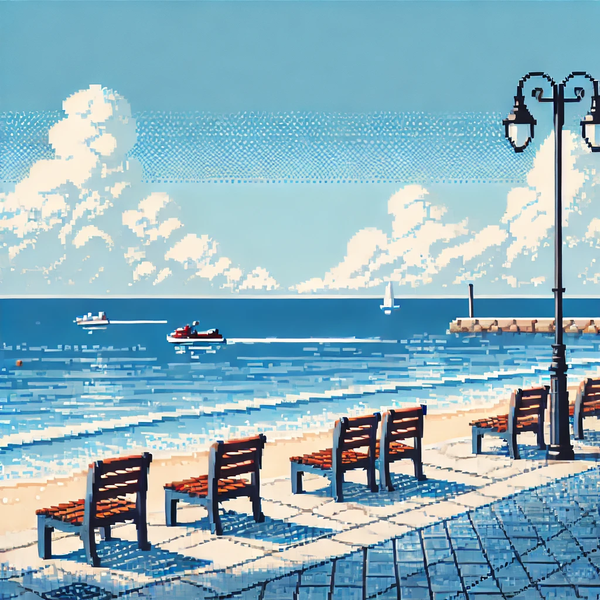

<!DOCTYPE html>
<html>
<head>
    <link rel="stylesheet" href="https://cdn.jsdelivr.net/gh/devicons/devicon@v2.15.1/devicon.min.css"/>
</head>
<body>
    <samp>
    <h1>Hi! I'm Juan Avalos</h1>
    </samp>
    

        
    

    

        <samp>
            <strong>CS Student at ITESM</strong>
            
I am a Third-Year Computer Science Student at Tecnologico de Monterrey, Campus Guadalajara . My main goal is to make a change aroud the world with technology an my expertise.

            <ul style = "margin-left: 20px">
                </li>
                  🌌 Currently learning WebDev, Data Structures & Algorithms!
            </ul>
            
You can contact me on <a href = "https://www.linkedin.com/in/juanvaloss/">Linkedin </a> 
            

        </samp>
             
        

    

     
     
    

        
        
        
        
        
        
        
        
        
        
        
        
        
    

</body>
</html>
